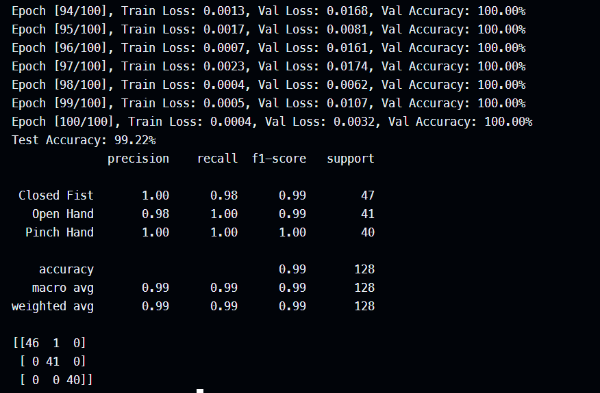
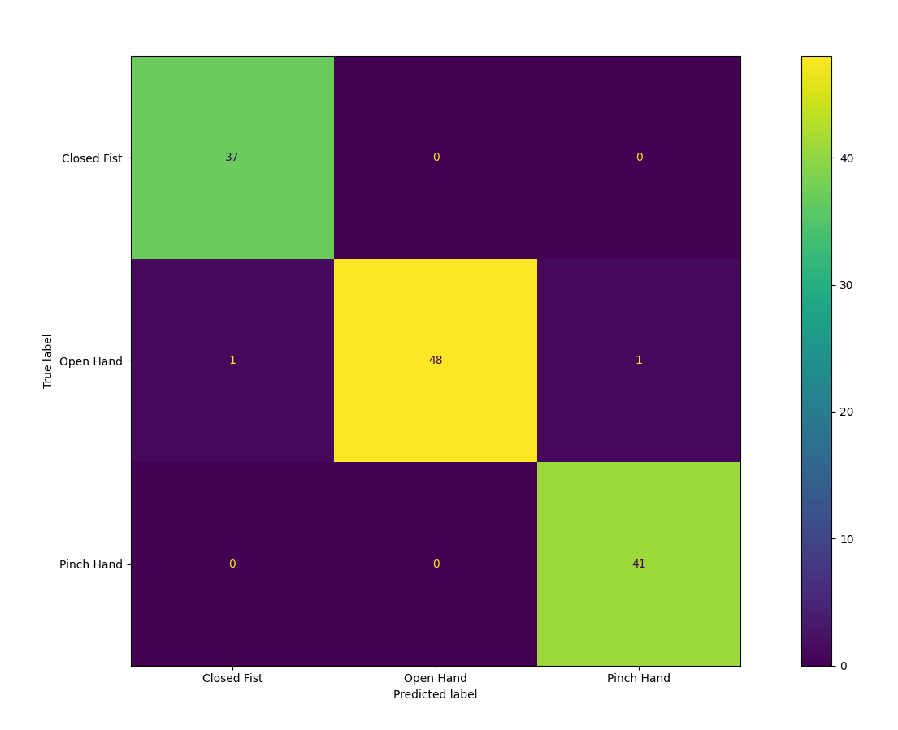

# EMG Signal Classifier Model

This project demonstrates signal classification of the squared EMG data obtained from [Gravity: Analog EMG Sensor by OYMotion
](https://www.dfrobot.com/product-1661.html) sensor.

The data has been collected through an [Arduino Nano](https://store.arduino.cc/products/arduino-nano) serial input.

## The CNN Model

This CNN model uses convolutional layers to progressively extract features with adjusted pooling and linear transformations.

### Inspirations behind using CNNs

- CNNs are capable of feature extraction, local connectivity and parameter sharing. This should be suitable for a time-series data like our EMG data.
- CNNs can often work directly with minimally processed or even raw EMG data (segmented into windows).
    - This reduces the need for extensive manual feature engineering which is a significant advantage. As noted by Jafarzadeh et al. (2019) in his work on deep learning for prosthetic hand control ([arXiv:1909.09910](https://arxiv.org/abs/1909.09910)).
- The application of CNNs to raw or transformed EMG segments (like STFT or wavelet-based images) allows the network to discover discriminative patterns that can indicate different muscle contractions or gestures (Kulwa et al., 2022, [arXiv:2209.05804](https://arxiv.org/abs/2209.05804)).

### Results

Our system uses sliding windows to segment the data, performs normalizations on each window, and then divides the data into training, validating, and testing data.

The testing data remain isolated throughout the training. The following results were observed with our initial data collection.

### Future enhancements

- An attention-enhanced CNNs can be implemented for better results as they are in use for classifying neuro-muscular diseases. (Rahman et al., 2023, [arXiv:2309.10483](https://arxiv.org/abs/2309.10483)).
- Recurrent layers like LSTMs are known to capture temporal dependencies better (López et al., as discussed in benchmarking studies, e.g., [arXiv:2411.15655](https://arxiv.org/abs/2411.15655)).

## Research Aspects

Developing good EMG classifiers presents several research challenges and opportunities for our project.

### Data Normalization

Consistent EMG results require better data normalization due to signal variability. The parameters that seem to vary signals between individuals are:
- body composition,
- sensor placement,
- gesture patterns across individuals,
- variance of signals within the same person over time and,
- environmental contamination of signals (due to EMI).

Addressing these issues needs advanced normalization techniques and adaptive learning.

### Economical Viability

Generally, prosthetics are deemed expensive. Our project explores low-cost EMG control using affordable hardware.

Through extensive research, we can optimize lightweight models for microcontrollers as well as create 3D-printed designs which are by nature more affordable.

### Multi-modal sensing 

If EMGs are combined with other sensors like IMUs, the control can be improved significantly. In fact, these researches are already being conducted [here](https://www.mdpi.com/1424-8220/22/24/9613).
